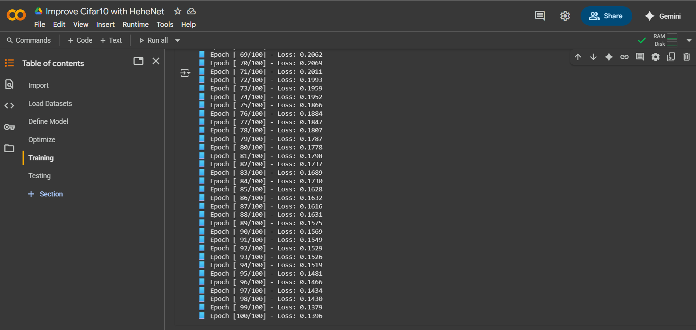
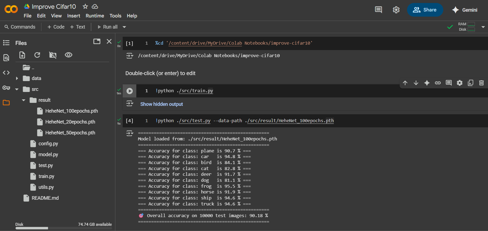

# CIFAR-10 Image Classification with HeheNet

A PyTorch implementation of image classification on the CIFAR-10 dataset using a custom CNN called **HeheNet**. The model achieves **90.16% accuracy** after 100 epochs of training.

This project has trained on **NVIDIA GEFORCE RTX 3050 LAPTOP GPU**.

## 📊 Model Performance

| Epochs | Accuracy |
|--------|----------|
| 20     | 84.16%   |
| 50     | 88.59%   |
| 100    | 90.16%   |

## 🏗️ Model Architecture

HeheNet is a custom CNN with the following architecture:
- **Conv Layer 1**: 3→32 channels, 3x3 kernel, padding=1, BatchNorm, ReLU
- **Conv Layer 2**: 32→64 channels, 3x3 kernel, padding=1, BatchNorm, ReLU, MaxPool
- **Conv Layer 3**: 64→128 channels, 3x3 kernel, padding=1, BatchNorm, ReLU, MaxPool  
- **Conv Layer 4**: 128→256 channels, 3x3 kernel, padding=1, BatchNorm, ReLU, MaxPool
- **Fully Connected 1**: 256×4×4 → 512, ReLU, Dropout(0.5)
- **Fully Connected 2**: 512 → 10 (output classes)

**Data Augmentation**: Random crop with padding, random horizontal flip, and normalization based on https://github.com/kuangliu/pytorch-cifar/issues/19 .

## 📋 Requirements

Install dependencies using the provided requirements file:

```bash
pip install -r requirements.txt
```

## 🚀 Setup Local 

### 1. Clone and Navigate
```bash
git clone git@github.com:holedev/improve-cifar10.git
cd improve-cifar10
```

### 2. Create Virtual Environment (Recommended)
```bash
python -m venv .venv
source .venv/bin/activate  # On Windows: .venv\Scripts\activate
```

### 3. Install Dependencies
```bash
pip install -r requirements.txt
```

## ☁️ Google Colab Setup

### 1. Upload Project to Colab
Upload the entire project folder to your Colab environment or mount Google Drive:

```python
from google.colab import drive
drive.mount('/content/drive')
%cd /content/drive/MyDrive/your-colab-path/improve-cifar10
```

### 2. Check GPU Availability (Recommended)
```python
import torch
print(f"CUDA available: {torch.cuda.is_available()}")
print(f"Device: {torch.device('cuda:0' if torch.cuda.is_available() else 'cpu')}")
```

## 🏋️ Training + Testing

### Configuration
Modify [`src/config.py`](src/config.py) to change training parameters:

```python
num_epochs = 20 
result_path = f"./src/result/HeheNet_{num_epochs}epochs.pth"
```

### Basic Training
```bash
python ./src/train.py
```

### Training with Custom Model Path
```bash
python ./src/train.py --data-path ./path/custom_model.pth
```

### Basic Testing
```bash
python ./src/test.py
```

### Testing with Custom Model Path (prevtrain model)
```bash
python ./src/test.py --data-path ./src/prevtrain/HeheNet_100epochs.pth
```

### Sample test output:
```
==================================================
Model loaded from: ./src/result/HeheNet_100epochs.pth
==================================================
=== Accuracy for class: plane is 90.7 % ===
=== Accuracy for class: car   is 94.8 % ===
=== Accuracy for class: bird  is 84.1 % ===
=== Accuracy for class: cat   is 82.8 % ===
=== Accuracy for class: deer  is 91.7 % ===
=== Accuracy for class: dog   is 81.1 % ===
=== Accuracy for class: frog  is 95.3 % ===
=== Accuracy for class: horse is 91.9 % ===
=== Accuracy for class: ship  is 94.6 % ===
=== Accuracy for class: truck is 94.6 % ===
==================================================
🎯 Overall accuracy on 10000 test images: 90.16 %
==================================================
```

## 📁 Project Structure

```
improve-cifar10/
├── README.md               # Project documentation
├── requirements.txt        # Python dependencies
├── .gitignore              # Git ignore rules
├── data/                   # CIFAR-10 dataset (auto-downloaded)
│   └── cifar-10-batches-py/
└── src/                    # Source code directory
    ├── config.py           # Training configuration
    ├── model.py            # HeheNet architecture definition
    ├── train.py            # Training script with CLI args
    ├── test.py             # Evaluation script with CLI args
    ├── utils.py            # Helper functions and class names
    └── result/             # Trained model weights
    └── prevtrain/          # Previous trained models
        └── HeheNet_100epochs.pth 
        └── HeheNet_50epochs.pth  
        └── HeheNet_20epochs.pth
```

## Screenshots
### Google Colab Training and Testing


